# Package
1. Django REST Framework API Key
   * guide : <https://florimondmanca.github.io/djangorestframework-api-key/guide/#making-authorized-requests>
   * `pip3 install "djangorestframework-api-key==3.*"`
2. djangorestframework-simplejwt
   * guide : <https://django-rest-framework-simplejwt.readthedocs.io/en/latest/>
   * `pip3 install djangorestframework-simplejwt`
3. ~~drfpasswordless~~
   * ~~guide : <https://github.com/aaronn/django-rest-framework-passwordless>~~
   * ~~`pip3 install drfpasswordless`~~
4. ~~allauth~~
   * ~~guide : <https://docs.allauth.org/en/latest/index.html>~~
   * ~~`pip3 install django-allauth`~~

## Command
* python3 manage.py startapp \<appname>
---
* python3 manage.py makemigrations \<appname>
* python3 manage.py migrate \<appname>

## App name convention
* all-lowercase names
   > user, core ..

## User Sequence Diagram

```mermaid
sequenceDiagram
    actor c as User
    participant s as IAP_Backend
    participant db as DB(IAP)

    
    c->>+s:[GET] /core/key
    s-->>-c:server public key(=pubkey), sign

    c-->>c: Verification<br/>pubkey and sign

    rect rgb(0, 0, 0)
        note left of c: RSA-OAEP-256
        c->>+s:[POST] /core/token (cipher)
        Note right of s: [Request Body]<br/>pubkey.encrypt<br/>({<br/>'email':'foo@foo.com',<br/>'device_id':'bad8274e04c6f2c6',<br/>'device_os':'Android'<br/>})
        alt invalid Message Field
            s-->>c: error[400] :(
        else invalid User Info
            s-->>c: error[400] :(
        else is well
            s->>+db : auth token
            db->>-s : 
            s-->>-c: jwt token (plain)
        end
    end

    rect rgb(100, 100, 1000)
        note left of c: Auth APIs
        c->>+s:[POST] /purchase
            alt token expire
                s-->>c: error[401] :(
                c->>s : [POST] /core/token/refresh
                s->>+db : auth token
                db->>-s : 
                s-->>c : jwt token
                c-->>c : retry /purchase
            else is well
                s-->>-c:result
            end
        


        %%%%%%%%%%

        c->>+s:[GET] /receipts/
        s->>+db : qurey receipt
        db->>-s : 
        s-->>-c:result
    end


    rect rgb(100, 100, 1000)
        note left of c: Consume goods
        c->>+s:[POST] /consume
        Note right of s: [Request Body]<br/>{<br/>'type':'[free|pay|contenet_type]',<br/>'target':'<userid><br/>}
        s-->>-c:result
    end

#doc : https://mermaid.js.org/syntax/sequenceDiagram.html
#config : "noteAlign": "left"

```

    
    
